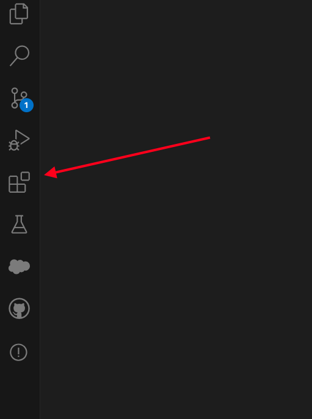
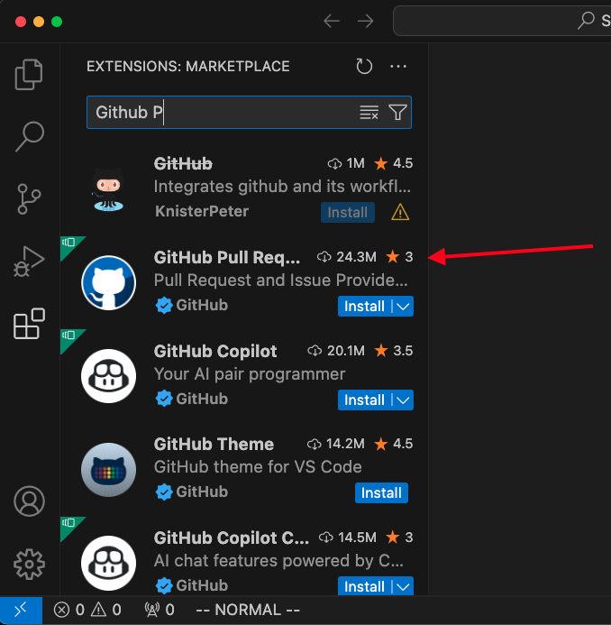
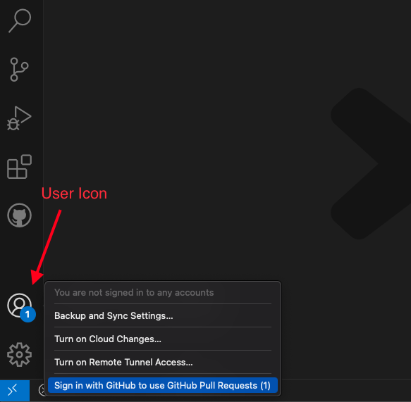
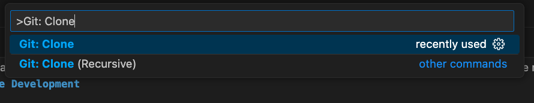
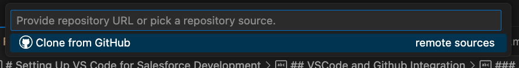
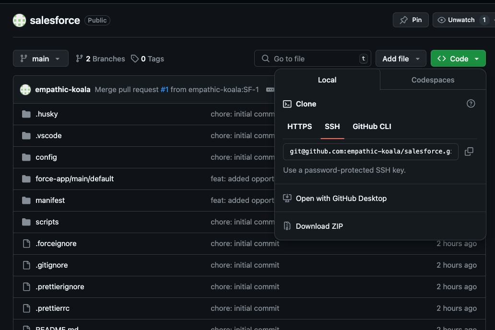
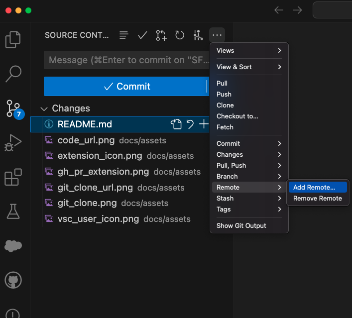

# Setting Up VS Code for Salesforce Development

This guide will walk you through setting up VSCode for Salesforce development.

The guide considers you already have:
* A Github account (to sign up for an account, navigate to https://github.com/ and follow the prompts.)
* VS Code installed (download [here](https://code.visualstudio.com/download)).
* A Salesforce org (a new one can be created [here](https://developer.salesforce.com/signup).)
* A Github repository created (to create one follow [these](https://docs.github.com/en/repositories/creating-and-managing-repositories/creating-a-new-repository) steps).

## Installing VSCode plugins for Salesforce Development

You can browse and install extensions from within VS Code. Bring up the Extensions view by clicking on the Extensions icon in the Activity Bar on the side of VS Code or the *View: Show Extensions* command (⇧⌘X).

Some of the recommended extensions for working on Salesforce Projects are:
* Salesforce Extension Pack
* Salesforce Package.xml generator
* Git Graph

We will be using all of these extensions for this project.

## VSCode and Github Integration

### Setting up SSH keys

To push and pull changes to Github, you need to authorize either using Personal Access Tokens (PAT) or SSH keys. For this project we will be using SSH keys.

Github has a great and very complete tutorial explaining how to add SSH keys that you can find [here](https://docs.github.com/en/authentication/connecting-to-github-with-ssh/adding-a-new-ssh-key-to-your-github-account).

### Manage Pull Requests from VS Code

To set up this integration we will use the [Github Pull Request and Issues](https://marketplace.visualstudio.com/items?itemName=GitHub.vscode-pull-request-github) extension. This extension allows you to review and manage GitHub pull requests and issues in Visual Studio Code. 

Once installed, we can sign in to your github account by clicking the user icon at the bottom left, and selecting *Sign in with Github to use GitHub Pull Requests*

This will redirect you to the Github website, fill in your credentials and then click *Authorize Visual-Studio Code*.

### Start working with a remote repository

#### Cloning

If you're starting from scratch and already have an existing remote repository where your team is working on, you typically want to clone the repo to start collaborating with your colleagues.

To do this, you can clone the repo by opening command palette (⇧⌘P) and selecting *Git: Clone*.

This will give you the option of using either the URL or cloning a repository from you Github account.

To get the url, go to the repository in Github and click the *Code* dropdown. Since we're using SSH, we should select the link under the SSH option (which should start with `git@github.com` not with `https://`).

After pasting this URL, VS Code will prompt you where in your computer you want to store the repository. Select a directory.

#### Adding a remote from an existing local repository

If you already started working on the repository locally and only after this created the remote Github repository, you have to add the remote to start pushing code into Github.

To do this, go to the Source Control tab in the Activity Bar, click on the three dots, then remote and add remote.

Then you can copy and paste the url of the created remote repo (remember to use the SSH version), and name it origin.